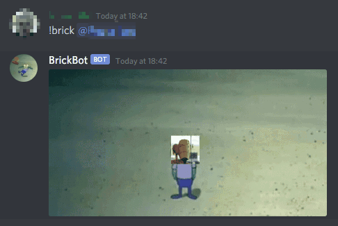

# brick-bot

Discord bot for when someone says something stupid.



## Usage

Download and run `cargo run --release` in root folder.

## Configuration

Bot reads config file `bot.toml` in the same folder it runs.

### Minimal configuration

```toml
token = "TOKEN_HERE" # Discord bot token
image_path = "brick.gif" # image to brick gif
command = "!brick" # bot will respond to this command

[keyframes] # sets avatar position
0 = {x = 0, y = 0}
```

### All bot settings:

- `token` - Discord bot authorizarion token
- `image_path` - path to gif to use
- `command` - command for bot to listen to

#### Optional:

- `self_brick_message` - if set, bot will will respond to self brick with a message
- `err_msg_tag_role` - error message send when user tags a role, not user
- `err_msg_tag_nobody` - error message send when user tags nobody
- `use_avatar_alpha` - if true, avatar will be overlaid with transparency
- `image_name` - image name sent to Discord

### All keyframe settings:

- `x` - x position of user avatar
- `y` - y position of user avatar

#### Optional:

- `scale` - avatar size scalar,
- `visible` - avatar visibility on keyframe,

## Things to do

- communication through WebSockets (bot will show as online when running)
- keyframe interpolation
